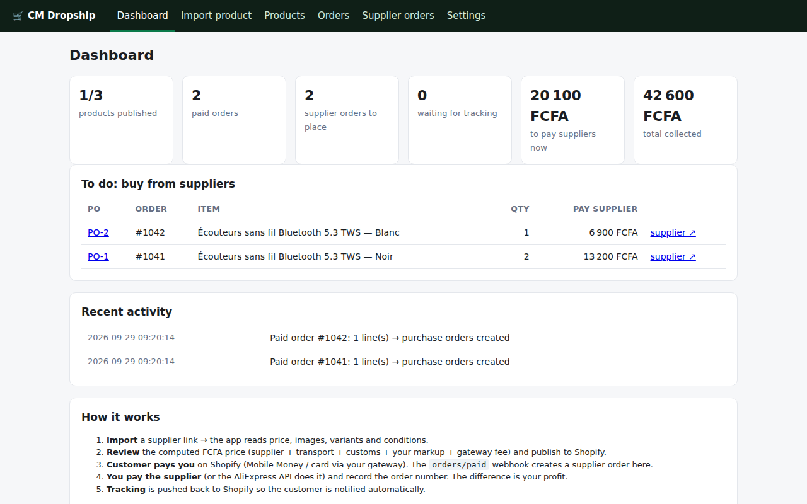
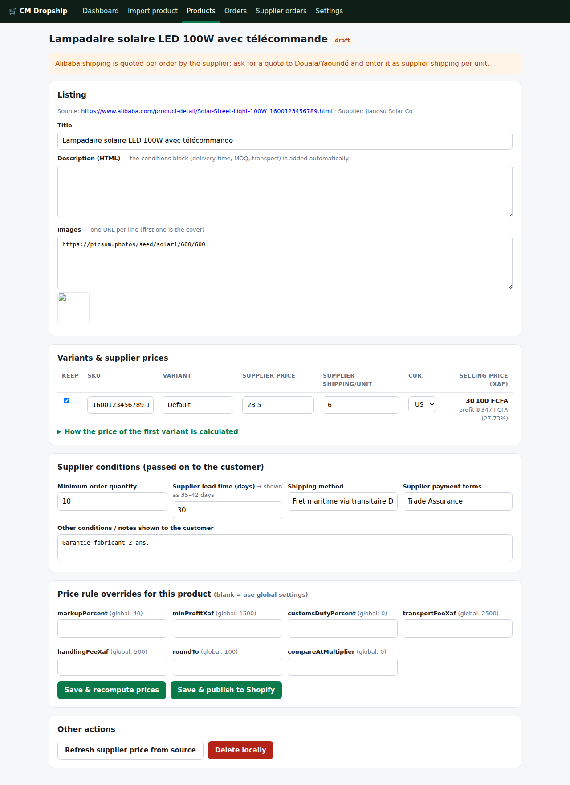
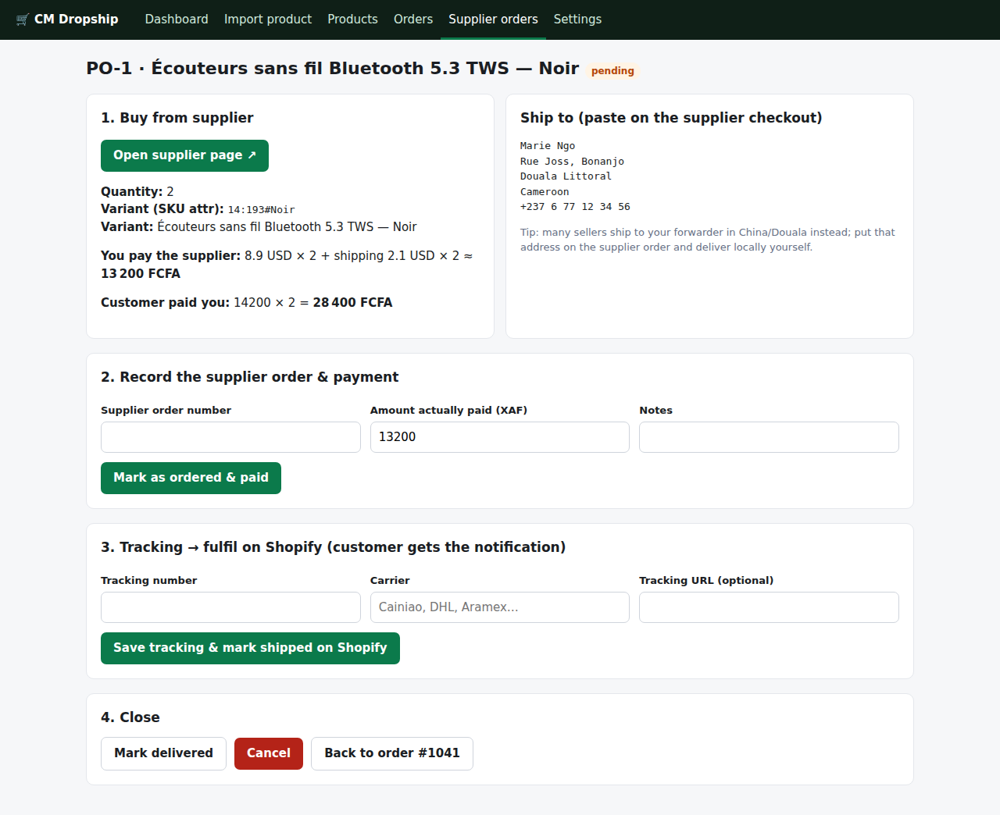

# CM Dropship — AliExpress/Alibaba → Shopify automation for Cameroon

Paste a supplier link, get a Shopify product priced in FCFA with your markup, transport, customs and the
supplier's conditions built in. When a customer pays you on Shopify, the app tells you exactly what to buy
from which supplier, what you owe them, and pushes the tracking number back to Shopify once the parcel
ships. With the AliExpress Dropshipping API it can even place and pay the supplier order for you.

```
 Supplier link ──► Import & price ──► Publish to Shopify ──► Customer pays YOU (MoMo / card)
 (AliExpress,      (XAF, markup,       (product, images,       │
  Alibaba)          transport,          variants, conditions)   ▼  orders/paid webhook
                    customs, fees)                    Supplier order created here
                                                      │  you (or the API) pay the supplier
                                                      ▼
                                             Tracking → Shopify fulfilment → customer notified
```

No database server, no build step: Node.js 22+, Express and the SQLite that ships with Node.

---

## 1. What you need before starting

| Item | Why |
|------|-----|
| **Shopify store** with currency set to **XAF** (Settings → Store details → Store currency) | Prices are computed in FCFA. |
| **A payment gateway that works in Cameroon** | Shopify Payments is not offered in Cameroon. Use a third‑party gateway that supports MTN MoMo / Orange Money / cards (e.g. Flutterwave, CinetPay, Paystack-compatible providers) or Shopify's *manual payment method* (customer pays by MoMo, you mark the order as paid in Shopify — this also fires the `orders/paid` webhook). |
| **Shopify custom app token** | Settings → Apps and sales channels → Develop apps → Create app → Configure Admin API scopes: `read_products, write_products, read_orders, write_orders, read_fulfillments, write_fulfillments, read_merchant_managed_fulfillment_orders, write_merchant_managed_fulfillment_orders, read_locations, read_publications, write_publications`. Install the app, copy the **Admin API access token** (`shpat_…`) and the **API secret key**. |
| **A public HTTPS URL** for this app | Shopify must reach `/webhooks/shopify`. On a laptop use `cloudflared tunnel --url http://localhost:3000` or ngrok; in production run it on a small VPS. |
| *(Optional, recommended)* **AliExpress Dropshipping API keys** | Reliable product data, live shipping cost to Cameroon, and automatic ordering/paying of the supplier. Register at https://openservice.aliexpress.com (Dropshipping app), then authorise your AliExpress buyer account to get an access token. Without it, the app reads the public product page, which AliExpress often blocks — you then fill the price in by hand. |

## 2. Run it

### Where can it be hosted? (not GitHub Pages)

GitHub Pages only serves static files (HTML/CSS/JS in the browser). This app is a **server**: it keeps a database
of your products and supplier orders, holds your Shopify secret key, and must be online to receive the
`orders/paid` webhook from Shopify. None of that can run on GitHub Pages. You have three good options:

| Option | Cost | Good for |
|--------|------|----------|
| **Your own laptop** + a tunnel | free | trying it out, importing products. Orders only arrive while the laptop is on. |
| **Fly.io** (config included) | free allowance | always‑on hosting with persistent storage, closest region Paris. Recommended start. |
| **Small VPS** with Docker (Hetzner, Contabo, OVH… ~€4/month) | cheap | full control, your own domain. |

Render.com also works (`render.yaml` included) but its free plan has no persistent disk, so your data is wiped
at each deploy; use it only on a paid instance.

### A. On your laptop (Windows, macOS or Linux)

1. Install **Node.js 22 or newer** from https://nodejs.org (LTS installer) and **Git** from https://git-scm.com.
2. Open a terminal (PowerShell on Windows) and run:
   ```bash
   git clone https://github.com/wouapit999/wouapit999.git
   cd wouapit999/dropship
   npm install
   copy .env.example .env      # macOS/Linux: cp .env.example .env
   ```
3. Open `.env` in Notepad/any editor and fill in at least `ADMIN_PASSWORD`, `SHOPIFY_STORE_DOMAIN`,
   `SHOPIFY_ADMIN_TOKEN`, `SHOPIFY_API_SECRET` (see section 1 for where these come from).
4. Start the app:
   ```bash
   npm start
   ```
5. Open **http://localhost:3000** in your browser. Login: user `admin`, password = your `ADMIN_PASSWORD`.
6. To receive orders while the laptop is on, expose the app with a free tunnel in a second terminal:
   ```bash
   # Cloudflare (no account needed):
   cloudflared tunnel --url http://localhost:3000
   ```
   Copy the `https://….trycloudflare.com` URL it prints into `APP_URL` in `.env`, restart `npm start`, then
   click **Register webhooks** in Settings. (ngrok works the same way.) The URL changes at each restart, so this
   is for testing; use option B or C for real sales.

### B. Free always‑on hosting on Fly.io (recommended)

```bash
# once: install flyctl from https://fly.io/docs/flyctl/install and create a free account
cd wouapit999/dropship
fly launch --copy-config --no-deploy          # accept the defaults; pick a unique app name when asked
fly volumes create dropship_data --size 1 --region cdg
fly secrets set ADMIN_PASSWORD=... SHOPIFY_STORE_DOMAIN=xxx.myshopify.com SHOPIFY_ADMIN_TOKEN=shpat_... \
                SHOPIFY_API_SECRET=shpss_... APP_URL=https://<your-app-name>.fly.dev
fly deploy
```
Your admin interface is then at `https://<your-app-name>.fly.dev`. Go to Settings → **Register webhooks**.
Redeploy after code updates with `git pull && fly deploy`; the database on the volume is kept.

### C. Docker on a VPS

```bash
git clone https://github.com/wouapit999/wouapit999.git && cd wouapit999/dropship
cp .env.example .env && nano .env            # APP_URL=https://shop-admin.yourdomain.com
docker compose up -d                          # app on port 3000, data in a Docker volume
```
Put Caddy or Nginx in front for HTTPS (Caddy: `reverse_proxy localhost:3000` with your domain), point your DNS
at the server, then register the webhooks from Settings.

### First steps in the interface

1. **Settings → Test connection** to check the Shopify token (it warns if the store currency is not XAF).
2. **Settings → Fetch live rates** (or type your own USD/CNY → XAF rates; add a few % if AliExpress/your bank charges a worse rate).
3. **Settings → Pricing rules**: markup %, minimum profit, transport per unit, customs %, gateway fee %, rounding.
4. **Settings → Register webhooks** (needs `APP_URL`). This subscribes `orders/paid` and `orders/cancelled`.
5. **Import product** → paste a supplier link.

### The web interface

The app serves its own admin interface; nothing else to install. It is protected by a password and meant for
you, not for customers (customers keep using your Shopify storefront).

| Page | What you do there |
|------|-------------------|
| **Dashboard** | KPIs, list of supplier orders you still have to place and pay, recent activity |
| **Import product** | paste an AliExpress/Alibaba link |
| **Products** → product page | edit listing, see supplier price → FCFA selling price with profit, conditions, publish to Shopify |
| **Orders** | paid Shopify orders with customer and address |
| **Supplier orders** | one line per item to buy: supplier link, quantity, address to paste, amount owed, mark ordered/paid, tracking → Shopify fulfilment |
| **Settings** | pricing rules, exchange rates, Shopify connection test, webhook registration, price sync, activity log |







## 3. Daily workflow

**Import** → paste an AliExpress or Alibaba product link → review page:

* title, description, images (editable),
* every variant with supplier price, supplier shipping to Cameroon, currency → computed **selling price in FCFA** with a profit line and a full breakdown,
* supplier conditions passed on to the customer: minimum quantity, lead time (+ your buffer), shipping method, notes → written into the Shopify description and product metafields,
* per‑product overrides of the pricing rules (e.g. heavier items → higher transport fee).

Click **Save & publish to Shopify**. The product is created (or updated) via the Admin GraphQL API, with
"continue selling when out of stock" and no inventory tracking, tagged `dropship`. Publishing to the Online Store
channel is attempted automatically; if your token lacks `write_publications`, tick the channel once in Shopify admin.

**When a customer pays**, the order appears under *Orders* and one **supplier order (PO)** per line under
*Supplier orders*, showing: supplier link + exact variant, quantity, the customer's address to paste at the
supplier checkout, what you owe the supplier in FCFA and what the customer paid you.

* Manual: buy it on AliExpress/Alibaba, then *Mark as ordered & paid* with the supplier order number.
* Automatic (AliExpress API + `ALIEXPRESS_AUTO_ORDER=true`): the order is placed and paid from your AliExpress
  account the moment the webhook arrives; the PO is marked *ordered* with the AliExpress order id. You can also
  trigger it per PO with the button *Place & pay on AliExpress automatically*.

**When it ships**, enter the tracking number (or *Fetch tracking from AliExpress*) → *Save tracking & mark
shipped on Shopify*: a fulfilment is created on the Shopify order and the customer gets the shipping email/SMS.

**Price drift**: *Refresh supplier price from source* on a product, *Sync all published now* in Settings, or
`npm run prices:sync` from cron / `PRICE_SYNC_INTERVAL_HOURS=12` in `.env`. If the supplier's price moved, the
selling price is recomputed and pushed to Shopify.

## 4. The pricing formula

```
goods          = supplierPrice × FX(supplierCurrency → XAF)
landedCost     = goods + supplierShipping×FX + goods×customsDuty% + transportFeeXaf + handlingFeeXaf
beforeFees     = max(landedCost × (1 + markup%), landedCost + minProfitXaf)
sellingPrice   = roundUp( beforeFees ÷ (1 − gatewayFee%) + gatewayFixedFeeXaf , roundTo )
```

Everything is configurable in *Settings*, and per product. The breakdown is displayed on every product page so
you can see exactly how much you keep after the gateway takes its cut and after you pay the supplier.

## 5. Files

```
src/server.js            Express app, Basic‑auth admin UI, webhook endpoint
src/routes/*.js          dashboard, import/review/publish, orders & supplier orders, settings
src/suppliers/types.ts   SupplierAdapter contract (Money, SupplierProduct, SupplierQuote, SupplierOrderRequest…)
src/suppliers/           aliexpress-adapter.js, alibaba-adapter.js (implement SupplierAdapter), registry.js, common.js
src/providers/           low-level marketplace access used by the adapters: aliexpress.js (DS API + page fallback), alibaba.js
src/pricing.js           pricing engine (pure functions, unit‑tested)
src/shopify.js           Admin GraphQL: productSet, publish, price updates, webhooks, fulfilments
src/webhooks.js          HMAC verification, orders/paid → purchase orders, optional auto‑order
src/sync.js              recompute prices, refresh from supplier, push to Shopify
src/db.js                SQLite schema + queries (data/dropship.sqlite — back this folder up)
src/scripts/             register-webhooks, sync-prices, update-fx
test/                    `npm test`   ·   `npm run typecheck` verifies the adapters against the TypeScript contract
```

### Adding another supplier

Implement `SupplierAdapter` from `src/suppliers/types.ts` in a new file under `src/suppliers/` and register it in
`registry.js`. Variant ids are `"<supplierProductId>:<supplier sku reference>"` so a purchase order can be placed
without a database lookup. `createPurchaseOrder` must be idempotent: reuse `getPurchaseRequest`/`savePurchaseRequest`
from `db.js` keyed by `idempotencyKey`, so a webhook retry can never pay a supplier twice. Set
`supportsAutomaticPurchasing = false` and throw `UnsupportedOperationError` for suppliers that must be bought
from by hand; the UI then shows the manual "mark as ordered & paid" flow only.

## 6. Limits you should know

* **Scraping is best‑effort.** AliExpress and Alibaba block automated page reads often (HTTP 403, captcha). The
  import never fails hard: you get a review form with warnings and fill in price/shipping by hand. For a real
  business, get the AliExpress Dropshipping API keys.
* **Alibaba has no ordering API** for individual buyers: orders are placed by you on Alibaba (Trade Assurance)
  and recorded here. Alibaba prices are quantity tiers with a **MOQ** — the app uses the lowest tier price and
  writes the MOQ into the listing; shipping must be quoted by the supplier and entered per unit.
* **Automatic supplier ordering** (`ALIEXPRESS_AUTO_ORDER`) spends real money from your AliExpress account.
  Test with one order and `false` first, and check the address mapping (Cameroon phone numbers, city/region).
* **Customs and taxes**: the `customsDutyPercent` rule is an estimate you set; check with your forwarder.
  You remain responsible for declaring and paying duties and for consumer law in Cameroon.
* **Supplier images and text** belong to the supplier. Most allow reuse for reselling; edit the listing if not.
* Refunds/returns are not automated: handle them in Shopify and update the PO status here.
