# Architecture

ResidenceFlow is a single **Next.js 15 (App Router) full-stack TypeScript** application backed by **PostgreSQL via Prisma**. Pages are React Server Components; mutations are **server actions**; integrations use **route handlers**. It deploys as-is to Vercel (serverless) or as a Docker container.

```
src/
  app/                 routes (UI + route handlers)
    (auth)/            login, forgot/reset password, activation, MFA, change password, 403
    (app)/             staff area (dashboard, properties … reports, admin, platform)
    portal/            tenant & occupant self-service portal
    api/               health, cron, payment webhooks, document download, CSV exports
    setup/, verify/    first-run bootstrap, public receipt verification
  domain/              PURE business rules (no I/O) — schedule, allocation, aging, late fees,
                       lease + work-order state machines, templates, TOTP. 100% unit tested.
  services/            transactional use-cases (billing, leases, dashboard, jobs, reports, …)
  lib/                 infrastructure: db, auth (session/context/actions), audit, money,
                       numbering, storage, notify (email/in-app), payments (provider adapters),
                       permissions catalogue, branding, format
  components/          UI kit (ui.tsx, forms.tsx), shell, charts, printable finance views
  i18n/                en/fr dictionaries + per-module message files
prisma/                schema, migrations, seed
tests/                 unit (domain) + integration (services against PostgreSQL)
```

## Module boundaries

| Layer | May import | Must not |
|---|---|---|
| `domain/*` | `lib/money` only | touch the DB, request, or React |
| `services/*` | `domain`, `lib` | render UI; trust caller-supplied IDs without scoping |
| `app/**/actions.ts` | `services`, `lib` | contain financial arithmetic (delegate to services/domain) |
| `app/**/page.tsx` | everything above | mutate data |

Financial logic lives in exactly one place: `src/services/billing.ts` (+ pure helpers in `src/domain`).

## Request lifecycle & authorization

1. **Middleware** (`src/middleware.ts`) adds CSP/security headers and a correlation ID, and redirects cookie-less requests for protected pages to `/login`. It is a convenience gate only.
2. **Session**: an opaque 256-bit random token in an `HttpOnly; SameSite=Lax; Secure` cookie. Only its SHA-256 hash is stored (`Session.tokenHash`). Sessions expire (configurable timeout), can be listed and revoked, and carry `mfaPending` until TOTP is verified.
3. **Context** (`getContext`, cached per request) loads the user, active roles, the union of permissions, the broadest role scope and the building assignment list.
4. Every page calls `requireContext(permission)`; every server action / route handler calls `authorize(permission)`.
5. **Record-level scope** is applied inside every query with helpers — `propertyWhere`, `unitWhere`, `leaseWhere`, `tenantWhere`, `invoiceWhere`, `paymentWhere`, `maintenanceWhere`, `byPropertyWhere` — which always include `organizationId` and, for building-scoped users, the assigned building IDs. IDs from the client are always re-loaded through these filters, so cross-organization / cross-building IDs resolve to "not found".
6. The tenant portal uses `requireTenantPortal()`, which binds every query to `ctx.tenantId`.

## Data isolation (multi-organization)

Every business table has `organizationId` (or inherits it from a parent that has one — e.g. `InvoiceLine` → `Invoice`). There is no query path that omits it: scoping helpers are the only way pages obtain `where` clauses, and services re-check ownership (`loadLease`, `findFirst({ id, organizationId })`). Platform super-admins have no `organizationId` and hold no tenant/financial permissions.

## Financial transaction handling

- Money columns are `NUMERIC(14,2)`; arithmetic uses `decimal.js` with ROUND_HALF_UP (`src/lib/money.ts`). No floats.
- **Posting a payment** (`recordPayment` → `confirmPaymentTx`) runs in one DB transaction: the tenant's open invoices are locked with `SELECT … FOR UPDATE`, balances re-read, the allocation computed (oldest first or validated manual lines), `amountPaid` updated, statuses re-derived, and an immutable **receipt** created with a JSON **snapshot** of everything printed. Concurrency is covered by an integration test that fires parallel payments.
- **Reversal** never deletes: allocations are flagged `reversed`, balances restored, a `PaymentReversal` row (with mandatory reason) and audit entry created, payment status → `REVERSED`. The original receipt remains and renders as "reversed".
- **Invoices** are immutable once issued: corrections via **void** (only when nothing is allocated) or **credit notes**.
- **Separation of duties**: high-value payments recorded by staff stay `PENDING` until a different user approves.
- **Numbering** (`nextNumber`) uses an atomic `UPDATE … SET nextValue = nextValue + 1` inside the caller's transaction, so numbers are unique per organization (also enforced by unique indexes).

## Background jobs

Vercel Cron calls `GET /api/cron/daily` (Bearer `CRON_SECRET`). `runOnce("daily:<date>")` inserts a unique `JobRun` row first, so concurrent or repeated invocations are no-ops; `?force=1` re-runs safely because every step is idempotent:

| Step | Idempotency mechanism |
|---|---|
| Rent schedule | unique `(leaseId, chargeType, periodStart)` + `createMany skipDuplicates` |
| Invoice generation | unique `(organizationId, idempotencyKey = schedule:<lease>:<due>)` + lease row lock |
| Late fees | unique `latefee:<invoiceId>` key — at most one fee per invoice |
| Reminders | `Notification.dedupeKey` (weekly key for overdue reminders) |
| Lease expiry, retention purge, token/session cleanup | state-based (re-running changes nothing) |

A Redis/BullMQ worker can replace the cron entry point without changing the services (see DECISIONS.md D-03).

## File storage

`src/lib/storage.ts` validates type (allow-list), size (≤ 4 MB) and **magic bytes**, runs the malware-scan hook, stores content + SHA-256 checksum and supports versions (`previousId`). Downloads go through `/api/documents/[id]`, which re-checks `canAccessDocument` on every request, returns `Cache-Control: private, no-store` and audits sensitive documents. Default backend is PostgreSQL `bytea`; the module is the seam for S3-compatible storage (signed, expiring URLs).

## Integrations

- **Payments**: `PaymentProvider` interface (`createPaymentIntent`, `verifyWebhook`, `queryTransaction`, `refund?`). `POST /api/webhooks/payments/[provider]` verifies the signature before parsing, matches the pending payment by provider reference and confirms it exactly once; amount/currency mismatches are never confirmed. A generic HMAC adapter is included for testing; **no mobile-money adapter is claimed operational** until real credentials and sandbox tests exist.
- **Email**: SMTP adapter (nodemailer). **SMS/WhatsApp**: hook point in `src/lib/notify/notify.ts`.

## Entity relationship diagram

```mermaid
erDiagram
  Organization ||--|| OrganizationSettings : has
  Organization ||--o{ User : employs
  Organization ||--o{ Role : defines
  User ||--o{ UserRole : holds
  Role ||--o{ UserRole : grants
  User ||--o{ UserPropertyScope : "assigned to"
  Property ||--o{ UserPropertyScope : scopes
  User ||--o{ Session : has
  User ||--o{ PasswordResetToken : has
  Organization ||--o{ AuditLog : records
  Organization ||--o{ NumberSequence : numbers
  Organization ||--o{ Property : owns
  Property ||--o{ Unit : contains
  Unit ||--o{ UnitStatusHistory : tracks
  Organization ||--o{ Tenant : has
  Tenant ||--o{ TenantContact : "co-tenants, occupants, guarantors"
  Tenant ||--o{ User : "portal users"
  Unit ||--o{ Lease : "leased by"
  Tenant ||--o{ Lease : signs
  Lease ||--o{ LeaseEvent : history
  Lease ||--o| Lease : "renews (previousLeaseId)"
  Lease ||--o{ RentSchedule : schedules
  RentSchedule }o--o| Invoice : "billed on"
  Tenant ||--o{ Invoice : owes
  Invoice ||--o{ InvoiceLine : lines
  Invoice ||--o{ CreditNote : credited
  Tenant ||--o{ Payment : pays
  Payment ||--o{ PaymentAllocation : allocates
  Invoice ||--o{ PaymentAllocation : settled
  Payment ||--o| PaymentReversal : reversed
  Payment ||--o| Receipt : receipted
  Lease ||--o| SecurityDeposit : secures
  SecurityDeposit ||--o{ DepositTransaction : movements
  Tenant ||--o{ CollectionNote : collections
  Property ||--o{ MaintenanceRequest : "work orders"
  Unit ||--o{ MaintenanceRequest : ""
  MaintenanceRequest ||--o{ WorkOrderUpdate : timeline
  User ||--o{ MaintenanceRequest : "assigned technician"
  Vendor ||--o{ MaintenanceRequest : "assigned vendor"
  Vendor ||--o{ User : "vendor users"
  Organization ||--o{ Expense : spends
  Property ||--o{ VisitorLog : visitors
  Property ||--o{ Parcel : parcels
  Property ||--o{ Incident : incidents
  Property ||--o{ ShiftLog : shifts
  Property ||--o{ KeyRecord : keys
  Unit ||--o{ Inspection : inspected
  Property ||--o{ Meter : meters
  Meter ||--o{ MeterReading : readings
  Organization ||--o{ Document : stores
  Organization ||--o{ Announcement : publishes
  User ||--o{ Notification : receives
  Tenant ||--o{ Message : "thread"
```


